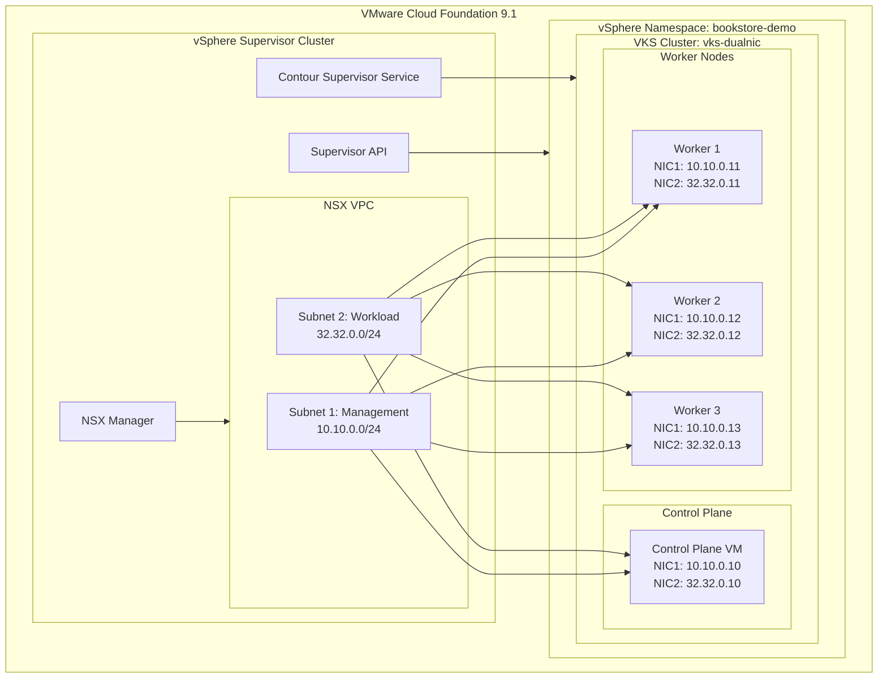
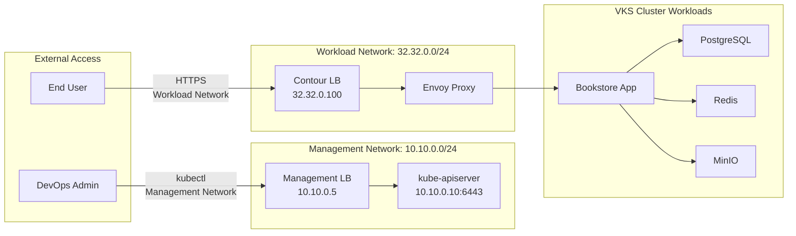
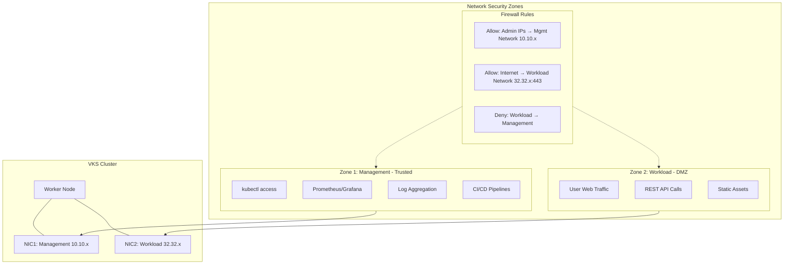
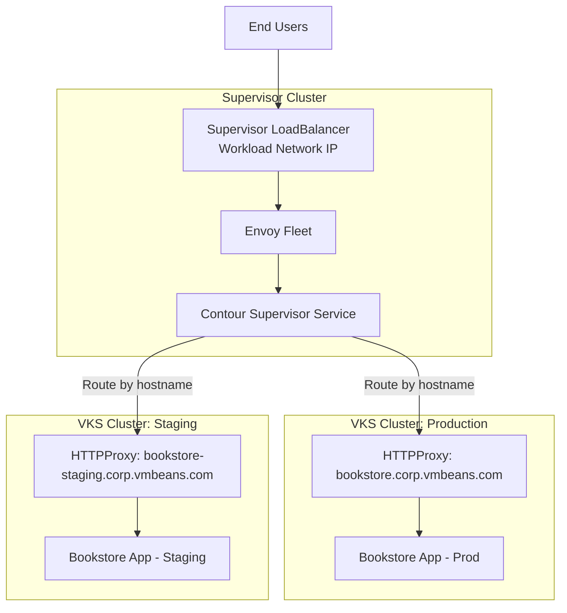

# VCF 9.1 Dual-Network VKS Demo Guide

This guide demonstrates the **Dual-Network Support for VKS** feature introduced in VMware Cloud Foundation (VCF) 9.1, using the Bookstore application to showcase security isolation between management and workload traffic.

## Table of Contents

- [Feature Overview](#feature-overview)
- [Architecture](#architecture)
- [Prerequisites](#prerequisites)
- [Deployment Guide](#deployment-guide)
- [Demo Script](#demo-script)
- [Validation and Testing](#validation-and-testing)
- [Troubleshooting](#troubleshooting)

---

## Feature Overview

### What is Dual-Network Support for VKS?

VCF 9.1 introduces the ability for VKS (vSphere Kubernetes Service) clusters to utilize **multiple network interfaces (NICs)** on cluster nodes. This enables network isolation between different types of traffic.

### Goals (from VCF 9.1 Feature Spec)

- All networks are exposed via a **Subnet in a VPC** attached to the vSphere Namespace
- VKS clusters can have **multiple networks** where each network is a subnet
- VCF 9.1 supports **two networks** (dual-NIC)
- Networks can be standard segments or VLANs, managed through NSX VPC

### Why This Matters: Security Isolation

In enterprise environments, separating management traffic from workload traffic is a security best practice:

| Traffic Type | Network | Purpose |
|--------------|---------|---------|
| **Management** | NIC 1 (10.x internal) | Kubernetes API, kubectl, metrics, logging, cluster operations |
| **Workload** | NIC 2 (32.32.x external) | User-facing application traffic, customer data, external access |

**Benefits:**
- Reduced attack surface - compromised workload traffic can't reach management plane
- Compliance requirements - separation of duties and network segmentation
- Performance isolation - high-volume user traffic doesn't impact cluster operations
- Simplified firewall rules - different security policies per network

---

## Architecture

### High-Level Architecture



### Network Traffic Flow



### Security Isolation Model



### Supervisor Contour Service Integration



---

## Prerequisites

### VCF 9.1 Environment Checklist

- [ ] VMware Cloud Foundation 9.1 or later deployed
- [ ] vSphere 9.x with Supervisor Cluster enabled
- [ ] NSX 4.x configured with VPC support
- [ ] Sufficient IP address space for two subnets

### NSX VPC Configuration

| Subnet | CIDR | Purpose |
|--------|------|---------|
| Management | 10.10.0.0/24 (internal) | Kubernetes API, cluster management |
| Workload | 32.32.0.0/24 (external) | User-facing application traffic |

### vSphere Namespace Requirements

- [ ] Namespace created with both subnets attached
- [ ] Storage policy assigned
- [ ] Resource quotas configured (CPU, Memory, Storage)
- [ ] Permissions granted to DevOps users

### VM Class with Dual-NIC Support

- [ ] VM Class created with 2 NIC configuration
- [ ] Appropriate CPU/Memory sizing for workloads
- [ ] VM Class associated with the namespace

### Supervisor Services

- [ ] Contour Supervisor Service enabled
- [ ] Harbor (optional, for private registry)

---

## Deployment Guide

### Step 1: VI Admin - Create Namespace with Dual Subnets

**In vSphere Client:**

1. Navigate to **Workload Management** → **Namespaces**
2. Click **Create Namespace**
3. Configure:
   - Name: `bookstore-demo`
   - Cluster: Select your Supervisor cluster
   - Networks: 
     - Primary (Management): `10.10.0.0/24`
     - Secondary (Workload): `32.32.0.0/24`
4. Assign storage policy and resource limits
5. Click **Create**

### Step 2: VI Admin - Create Dual-NIC VM Class

**In vSphere Client:**

1. Navigate to **Workload Management** → **VM Classes**
2. Click **Create VM Class**
3. Configure:
   - Name: `dual-nic-medium`
   - CPUs: 4
   - Memory: 8 GB
   - NICs: 2
4. Click **Create**
5. Associate the VM Class with the `bookstore-demo` namespace

### Step 3: VI Admin - Enable Supervisor Contour Service

**In vSphere Client:**

1. Navigate to **Workload Management** → **Supervisor** → **Services**
2. Find **Contour** in the available services
3. Click **Enable**
4. Configure:
   - Network: Select the **Workload** subnet (`32.32.0.0/24`)
   - This ensures Contour's LoadBalancer gets an IP on the workload network
5. Wait for the service to become **Ready**

### Step 4: DevOps - Create VKS Cluster with Dual-NIC

**Create the cluster specification:**

```yaml
# vks-dualnic-cluster.yaml
apiVersion: cluster.x-k8s.io/v1beta1
kind: Cluster
metadata:
  name: vks-dualnic
  namespace: bookstore-demo
spec:
  clusterNetwork:
    services:
      cidrBlocks: ["10.96.0.0/12"]
    pods:
      cidrBlocks: ["10.244.0.0/16"]
  topology:
    class: tanzukubernetescluster
    version: v1.28.4+vmware.1-fips.1-tkg.1
    controlPlane:
      replicas: 1
      metadata:
        annotations:
          run.tanzu.vmware.com/resolve-os-image: os-name=ubuntu
    workers:
      machineDeployments:
        - class: node-pool
          name: worker-pool
          replicas: 3
          metadata:
            annotations:
              run.tanzu.vmware.com/resolve-os-image: os-name=ubuntu
    variables:
      - name: vmClass
        value: dual-nic-medium
      - name: storageClass
        value: vsan-default-storage-policy
      # Dual-NIC Configuration (VCF 9.1+)
      - name: network
        value:
          primary: management-subnet    # NIC 1
          secondary: workload-subnet    # NIC 2
```

**Apply the cluster:**

```bash
# Login to Supervisor
kubectl vsphere login --server=<supervisor-ip> -u administrator@vsphere.local

# Switch to the namespace
kubectl config use-context bookstore-demo

# Create the cluster
kubectl apply -f vks-dualnic-cluster.yaml

# Watch cluster creation
kubectl get cluster vks-dualnic -w
```

**Wait for cluster to be ready (10-15 minutes):**

```bash
# Check cluster status
kubectl get cluster vks-dualnic

# Get kubeconfig for the new cluster
kubectl get secret vks-dualnic-kubeconfig -o jsonpath='{.data.value}' | base64 -d > vks-dualnic.kubeconfig

# Verify nodes have dual NICs
KUBECONFIG=vks-dualnic.kubeconfig kubectl get nodes -o wide
```

### Step 5: DevOps - Configure Contour HTTPProxy

**Create HTTPProxy for the bookstore application:**

```yaml
# httpproxy-bookstore.yaml
apiVersion: projectcontour.io/v1
kind: HTTPProxy
metadata:
  name: bookstore
  namespace: bookstore
spec:
  virtualhost:
    fqdn: bookstore.corp.vmbeans.com
  routes:
    - conditions:
        - prefix: /
      services:
        - name: app-service
          port: 80
      timeoutPolicy:
        response: 60s
      retryPolicy:
        count: 3
        perTryTimeout: 10s
```

**Apply the HTTPProxy:**

```bash
KUBECONFIG=vks-dualnic.kubeconfig kubectl apply -f httpproxy-bookstore.yaml
```

### Step 6: DevOps - Deploy Bookstore Application

**Use the existing deployment script:**

```bash
# Set kubeconfig
export KUBECONFIG=vks-dualnic.kubeconfig

# Run deployment (skip build if image already exists in Harbor)
./scripts/deploy-complete.sh v1.1.0 --skip-build

# Or with custom namespace
K8S_NAMESPACE=bookstore ./scripts/deploy-complete.sh v1.1.0 --skip-build
```

**Verify deployment:**

```bash
kubectl get pods -n bookstore
kubectl get svc -n bookstore
kubectl get httpproxy -n bookstore
```

### Step 7: Verify Network Isolation

**Check node network interfaces:**

```bash
# SSH to a worker node or use kubectl debug
kubectl debug node/<node-name> -it --image=busybox

# Inside the debug container
ip addr show
# Should see two interfaces with IPs from different subnets:
# - eth0: 10.10.0.x (Management - internal)
# - eth1: 32.32.0.x (Workload - external)
```

**Verify Contour LoadBalancer is on workload network:**

```bash
kubectl get svc -n projectcontour envoy -o wide
# EXTERNAL-IP should be in 32.32.0.0/24 range (external)
```

---

## Validation and Testing

### Verify Dual-NIC Configuration

```bash
# Check node has two IPs
kubectl get nodes -o jsonpath='{range .items[*]}{.metadata.name}{"\t"}{.status.addresses[*].address}{"\n"}{end}'

# Detailed node network check
kubectl debug node/<node-name> -it --image=nicolaka/netshoot -- sh -c "ip addr; ip route"
```

### Verify Traffic Isolation

```bash
# From a pod, try to reach management network (should be blocked by network policy)
kubectl run test-pod --rm -it --image=busybox -- wget -T 5 http://10.10.0.10:6443
# Expected: timeout or connection refused

# From a pod, reach workload services (should work)
kubectl run test-pod --rm -it --image=busybox -- wget -T 5 http://app-service.bookstore.svc.cluster.local
# Expected: success
```

### Verify Contour Routing

```bash
# Check HTTPProxy status
kubectl get httpproxy -n bookstore -o yaml

# Look for:
# status:
#   currentStatus: valid
#   description: Valid HTTPProxy

# Test routing
curl -H "Host: bookstore.corp.vmbeans.com" http://<contour-lb-ip>/
```

---

## Troubleshooting

### Cluster Creation Fails

```bash
# Check cluster status
kubectl describe cluster vks-dualnic -n bookstore-demo

# Check machine status
kubectl get machines -n bookstore-demo

# Check events
kubectl get events -n bookstore-demo --sort-by='.lastTimestamp'
```

### Nodes Only Have One NIC

- Verify VM Class has 2 NICs configured
- Verify namespace has both subnets attached
- Check cluster spec includes both networks in the `network` variable

### Contour LoadBalancer Has No IP

```bash
# Check Contour service
kubectl get svc -n projectcontour

# Check NSX LoadBalancer status
kubectl describe svc envoy -n projectcontour

# Verify Supervisor Contour Service is healthy
# In vSphere Client: Workload Management → Services → Contour
```

### Application Not Accessible

```bash
# Verify HTTPProxy is valid
kubectl get httpproxy -n bookstore

# Check Envoy logs
kubectl logs -n projectcontour -l app=envoy

# Verify DNS resolution
nslookup bookstore.corp.vmbeans.com
```

---

## Additional Resources

- [VCF 9.1 Release Notes](https://docs.vmware.com/en/VMware-Cloud-Foundation/)
- [vSphere Supervisor Documentation](https://techdocs.broadcom.com/us/en/vmware-cis/vcf/vsphere-supervisor-services-and-standalone-components/latest.html)
- [Contour Documentation](https://projectcontour.io/docs/)
- [NSX VPC Documentation](https://docs.vmware.com/en/VMware-NSX/)
- [Antrea Secondary Network](https://antrea.io/docs/)

---

## Appendix: Sample YAML Files

### Complete Cluster Specification

```yaml
# vks-dualnic-complete.yaml
apiVersion: cluster.x-k8s.io/v1beta1
kind: Cluster
metadata:
  name: vks-dualnic
  namespace: bookstore-demo
  labels:
    environment: demo
    feature: dual-network
spec:
  clusterNetwork:
    services:
      cidrBlocks: ["10.96.0.0/12"]
    pods:
      cidrBlocks: ["10.244.0.0/16"]
  topology:
    class: tanzukubernetescluster
    version: v1.28.4+vmware.1-fips.1-tkg.1
    controlPlane:
      replicas: 1
    workers:
      machineDeployments:
        - class: node-pool
          name: worker-pool
          replicas: 3
    variables:
      - name: vmClass
        value: dual-nic-medium
      - name: storageClass
        value: vsan-default-storage-policy
      - name: network
        value:
          primary: management-subnet
          secondary: workload-subnet
```

### HTTPProxy with TLS

```yaml
# httpproxy-bookstore-tls.yaml
apiVersion: projectcontour.io/v1
kind: HTTPProxy
metadata:
  name: bookstore-tls
  namespace: bookstore
spec:
  virtualhost:
    fqdn: bookstore.corp.vmbeans.com
    tls:
      secretName: bookstore-tls-cert
  routes:
    - conditions:
        - prefix: /
      services:
        - name: app-service
          port: 80
```

### Network Policy for Isolation

```yaml
# network-policy-isolation.yaml
apiVersion: networking.k8s.io/v1
kind: NetworkPolicy
metadata:
  name: workload-isolation
  namespace: bookstore
spec:
  podSelector: {}
  policyTypes:
    - Ingress
    - Egress
  ingress:
    # Allow traffic from Contour/Envoy
    - from:
        - namespaceSelector:
            matchLabels:
              name: projectcontour
      ports:
        - protocol: TCP
          port: 8080
    # Allow internal namespace traffic
    - from:
        - podSelector: {}
  egress:
    # Allow DNS
    - to:
        - namespaceSelector: {}
      ports:
        - protocol: UDP
          port: 53
    # Allow internal namespace traffic
    - to:
        - podSelector: {}
    # Block management network (internal)
    - to:
        - ipBlock:
            cidr: 0.0.0.0/0
            except:
              - 10.10.0.0/24
```

